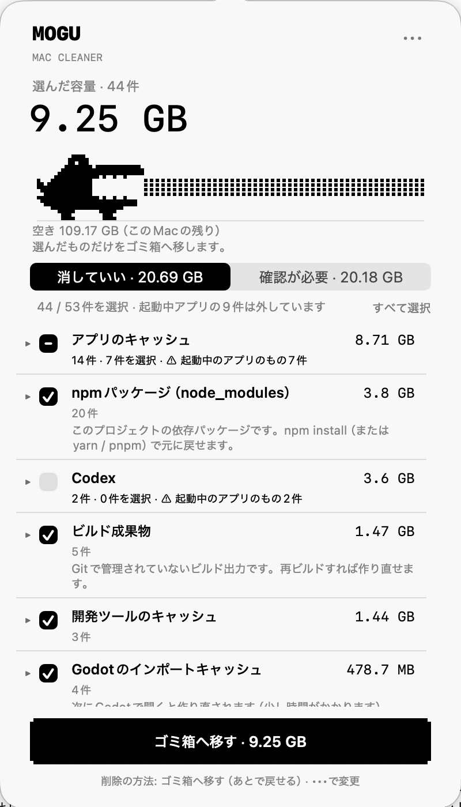

# Mogu

Macの容量を空けるメニューバーアプリです。消していいもの・確認が必要なものを注釈つきで一覧にし、メニューの中だけで選んで片づけられます。



- フォルダを選ぶ必要はありません。開くとすぐに調べ始めます（10秒前後）。
- 「npmパッケージ」「アプリのキャッシュ」のように種類ごとにまとめ、何なのか・消すとどうなるかを表示します。
- ゴミ箱へ移すか、すぐに完全削除するかを設定で選べます。
- Swift / AppKit製です。外部ライブラリは使っていません。通信もしません。

## 動作環境

macOS 13以降（Apple Silicon / Intel）

## インストール

1. [Releases](../../releases) から `Mogu-x.y.z-macOS.zip` をダウンロードして展開し、`Mogu.app` を「アプリケーション」フォルダへ移します。
2. 初回は、Appleの公証を受けていないため「開けません」と表示されます。次のどちらかで開いてください。
   - 「システム設定」→「プライバシーとセキュリティ」を開き、Moguについての表示の「このまま開く」を押す
   - ターミナルで `xattr -dr com.apple.quarantine /Applications/Mogu.app` を実行してから開く
3. メニューバーにワニが出ます。クリックすると一覧が開きます。

ダウンロードフォルダを初めて調べるときは、macOSがアクセスの許可を確認します。許可しない場合、ダウンロードフォルダ以外だけを調べます。

## 使い方

- **消していい**：再生成できるものです。初めから選択されています。
- **確認が必要**：消すと戻せない、または使っているかもしれないものです。初めは選択されていません。

種類の行の ▸ で中身を開くと、プロジェクト別・アプリ別に選べます。関連アプリ（Chromeなど）が起動中のものは自動では選ばず、実行時にも起動中なら見送ります。

実行前に、選んだ内容をメニューの中で確認します。結果と見送った理由も同じ画面に出ます。

### 削除の方法

「•••」→「削除の方法」で選べます。

- **ゴミ箱へ移す（既定）**：「•••」→「履歴・元に戻す」から戻せます。空き容量はゴミ箱を空にしたときに増えます。
- **すぐに完全削除**：ゴミ箱を通さずに削除します。元に戻せません。

## 調べる場所

| 種類 | 場所 | 分類 |
|---|---|---|
| アプリのキャッシュ | `~/Library/Caches/*`（`com.apple.*` は除く） | 消していい |
| 開発ツールのキャッシュ | npm / npx / yarn / pnpm / bun / uv / pip / Gradle / cargo | 消していい |
| Xcode・シミュレータ | DerivedData、iOS DeviceSupport、シミュレータのキャッシュ | 消していい（Archivesは確認が必要） |
| プロジェクトの依存・ビルド出力 | `node_modules`、`.next` / `.turbo` など、Pods、`.build`、Rustの `target`、Godotの `.godot`、Unityの `Library` / `Temp` / `obj`、Pythonの仮想環境、`build` / `Builds` | 消していい（下記参照） |
| Codex | 実行環境、アップデートの残り、インストール時の一時ファイル | 消していい |
| Codex / Claudeのデータ | Codexの会話（2か月以上前の月）、生成画像、Claudeアプリの仮想環境、2週間使っていないClaude Codeの会話 | 確認が必要 |
| ダウンロード | `~/Downloads` 直下の50 MB以上のもの | 確認が必要 |

プロジェクトは `~/Developer`、`~/Projects`、`~/dev`、`~/src`、`~/code`、`~/repos`、`~/GitHub`、`~/workspace` の中を探します。

`build` / `Builds` は、Gitで管理されていないと確認できた場合だけ「消していい」に入れます。Gitで管理されているものは出しません。Gitリポジトリの外にあるものは「確認が必要」にします。`dist` は公開物の可能性があるため「確認が必要」です。

## 安全のための仕組み

- 自動では何も消しません。
- 実行直前に、調べたときと同じもの（デバイス・inode・種類）であることを確かめます。入れ替わっていれば見送ります。
- ホームフォルダの外、リンク経由の場所、Gitリポジトリそのもの、iCloud上の項目、`.ssh` などは対象にしません。`~/Library` などの親フォルダそのものも対象にしません。
- 実行前に履歴を保存します。履歴が読めない場合は何も変更しません。
- 容量はディスク上の使用量で数えます。リンク先は数えず、ハードリンクは1回だけ数えます。

フォルダを選ばずに調べるため、App Sandboxは使っていません。

## ビルド

```bash
zsh scripts/build.sh
```

`build/Release/Mogu.app`（Universal、アドホック署名）ができます。配布用のzipは `zsh scripts/package.sh` で `build/` に作られます。Xcodeで編集する場合は `Mogu.xcodeproj` を開いてください（定義は `project.yml`）。

## テスト

```bash
CLANG_MODULE_CACHE_PATH="$PWD/build/module-cache" swift test --scratch-path build/swift-tests --cache-path build/swift-cache --disable-sandbox
```

テストは `build/test-runs` に作る仮のホームフォルダだけを使います。実際のファイルには触れません。

## ライセンス

[MIT](LICENSE)。本ソフトウェアは無保証です。ファイルを削除するアプリのため、内容を確認してから実行してください。
